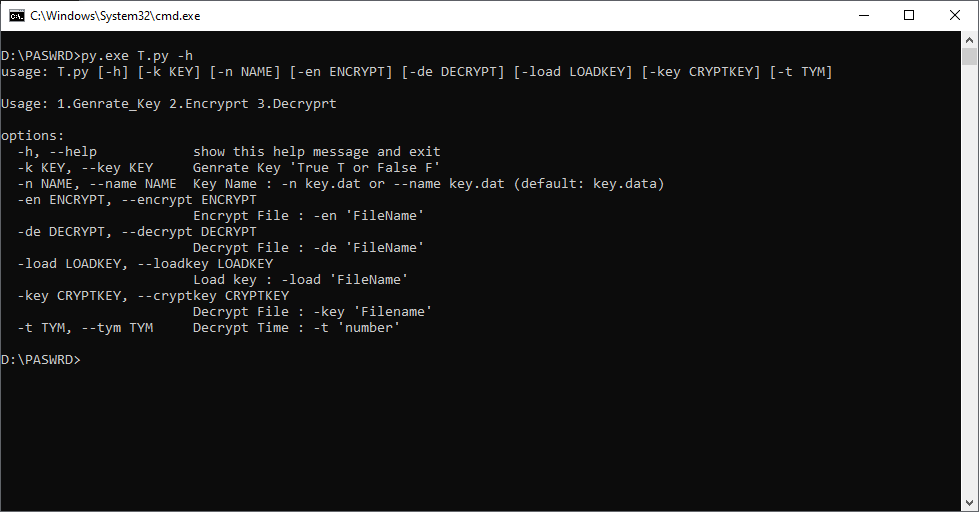
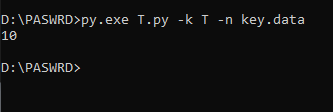
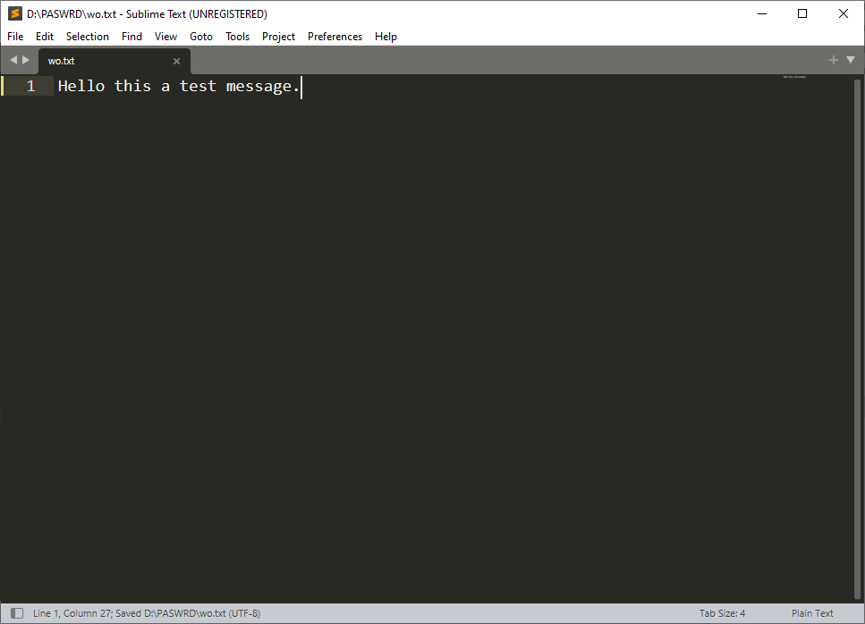
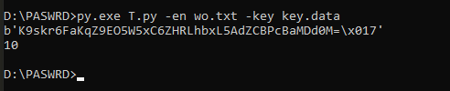
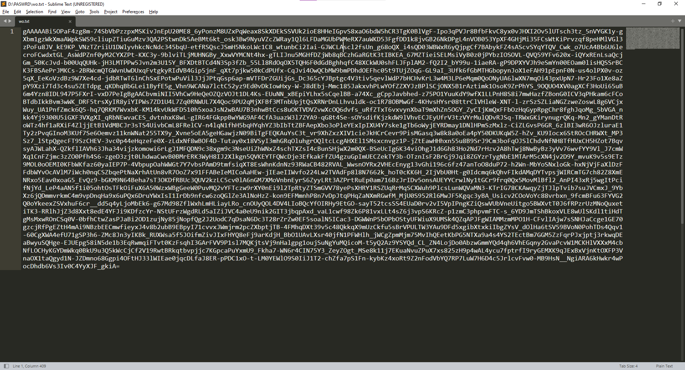
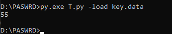

# Trick_Encryption
How to use:
 
Step 1 : Clone or download the repo.
Step 2 : Extract the zip to your desktop.

## Genrate Key: 
> py.exe T.py -k T -n 'KeyName.anything' 
> 5 (Remember the Code here) 
  

Message:  
## Encryption: 
> py.exe T.py -en 'FileName' -key 'keyName.anything' 
> b'2X7dMLTgWcyNZq09-Bv-WxtOKiPR9QH0XWUmJvflpi8=\x02z' 
> 5 
  

## Decryption: 
> py.exe T.py -de 'FileName' -key 'keyName.anything' -t 5 
 
 

## Know the key code: 
> py.exe T.py -load 'keyName.anything' 
> 10 
> Note : 5 + 5 = <b>10</b> (Key Code) 
 

<b> All done Enjoy the App.</b>
